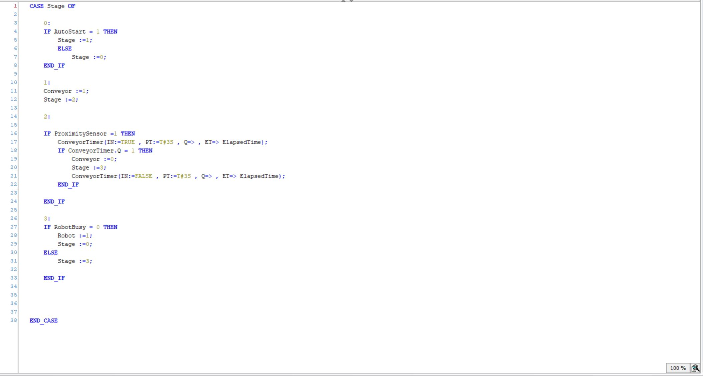
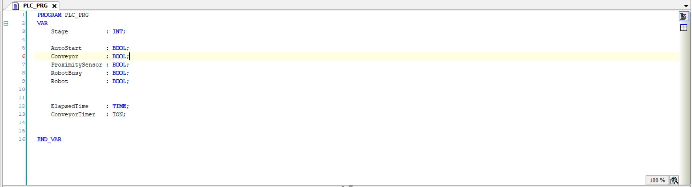

# Finite State Machine – PLC Project (Structured Text)

This project demonstrates a **Finite State Machine (FSM)** implementation using **Structured Text (ST)** to control a conveyor and an industrial robot system in a PLC environment.

## 📌 Project Description

The system simulates a basic automated station with the following sequence:

1. **Auto Start** is triggered by an operator.
2. Conveyor is turned on to move an object into position.
3. A **proximity sensor** detects the object after a timer delay.
4. Conveyor stops and a **robot** is activated.
5. Once the robot finishes its task, the system returns to the initial state.

This logic is implemented as a **state-based system (FSM)** using a variable `Stage` and `CASE` logic in Structured Text.

---

## 🧠 PLC Tags Used

| Tag              | Type | Description                    |
|------------------|------|--------------------------------|
| `AutoStart`      | BOOL | Start signal from operator     |
| `ProximitySensor`| BOOL | Detects presence of object     |
| `Conveyor`       | BOOL | Conveyor motor output          |
| `RobotBusy`      | BOOL | Robot operation status         |
| `Robot`          | BOOL | Robot activation output        |
| `Stage`          | INT  | FSM control stage              |
| `ConveyorTimer`  | TON  | Timer for object entry delay   |

---

## 🖼 Screenshots

### Main Program Logic (FSM in ST)

### System Overview

---

## 💾 Files Included

- `Finite State Machine.project`: Main PLC project file (e.g., CODESYS)
- `FSM_PLC_Control.st`: Extracted Structured Text program logic
- `Conveyor.JPG` and `Conveyor.ST.JPG`: Visuals for reference

---

## ✅ Author

**Pedram Nafisi**  
> Industrial Automation & PLC Enthusiast  
> [LinkedIn](https://www.linkedin.com/in/pedram-nafisi)

---

## 📄 License

This project is shared for learning and demonstration purposes. Use freely with credit.
